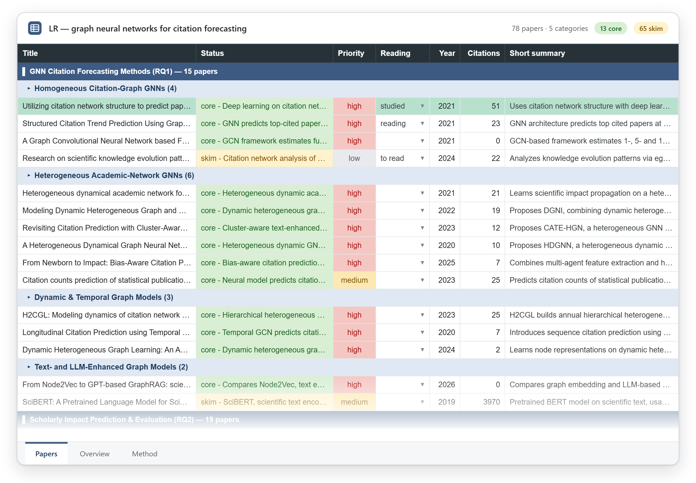
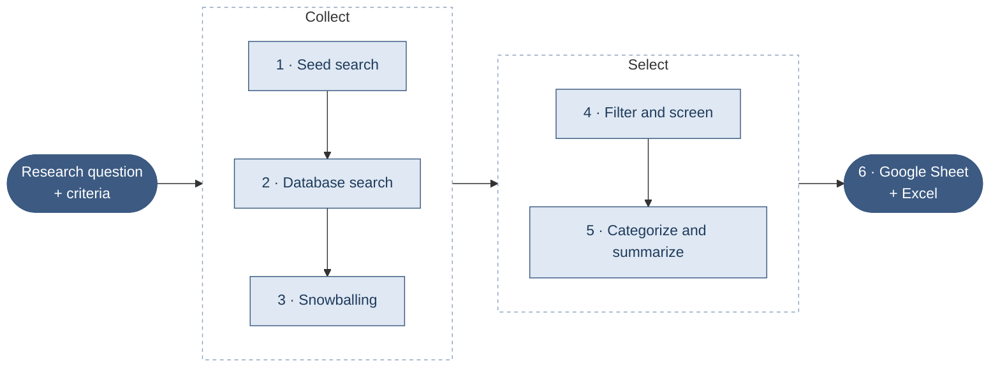

<div align="center">


# LR-AI

**Automated literature reviews for Claude Code**

From a research question to a categorized, summarized Google Sheet of papers, in one command.

[](https://github.com/YAZANGTHB/lr-ai/actions/workflows/tests.yml)
[](LICENSE)
[](https://www.python.org/downloads/)
[](https://claude.com/claude-code)
[](#how-it-works)

[Use cases](#use-cases) · [What you get](#what-you-get) · [Quick start](#quick-start) · [How it works](#how-it-works) · [Without Claude Code](#without-claude-code) · [Privacy](#privacy-and-data) · [Docs](docs/phases.md)

</div>

## Use cases

| | Use case | Type in Claude Code |
|:-:|---|---|
| 📝 | **Related work for a paper or thesis**<br>The papers on your topic, grouped by theme, each with a summary and a reading priority. | `/lr-ai:lit-review graph neural networks for citation forecasting` |
| 🔬 | **Systematic or scoping review**<br>Approve the queries, the screening and the categories as you go. The Method tab records every query, the criteria and PRISMA-style counts for your methods section. | `/lr-ai:lit-review <topic> --step` |
| 🌱 | **Grow a reading list from papers you trust**<br>Their references and the papers that cite them, most-cited first, with duplicates merged. | *"Snowball from 10.1126/science.1237825 and arXiv:2009.02647"* |
| ✅ | **Screen a long list of candidates**<br>Core, skim or exclude for every paper, each with a one-line reason you can overrule. | *"Screen the candidates, keeping only papers that propose a forecasting method"* |
| 👥 | **A shared reading list for your group**<br>A Google Sheet with reading-status dropdowns, notes and a reviewer column. | *"Export the review to Google Sheets"* |
| 🧭 | **Get oriented in a new field**<br>The field's sub-areas as categories, with papers per category and per year and the top venues. | `/lr-ai:lit-review <the field you are entering>` |

## What you get



<p align="center"><sub>The Papers tab of a real run: 78 papers on graph neural networks for citation forecasting.</sub></p>

| Tab | Contents |
|---|---|
| **Papers** | One row per included paper, grouped by category and sub-category. Status (core or skim, with the screening reason), priority, a reading-status dropdown (marking a paper studied highlights its row), notes, reviewer, summaries, the RQ it informs, how it was found, and links. Frozen header, filters on every column. |
| **Overview** | Papers per category and sub-category, per year, and the top venues. |
| **Method** | Topic, research questions, criteria, every query, the databases, snowballing settings, filters and a PRISMA-style flow (identified → duplicates → filtered → screened → included), ready for a methods section. |

The same workbook is saved as `papers.xlsx` in the run folder. Without Composio, import it into Google Sheets
(File → Import) and the formatting carries over.

## Quick start

**Requirements:** [Claude Code](https://claude.com/claude-code) and Python 3.9+. For the Google Sheet, connect
[Composio](https://composio.dev)'s Google Sheets toolkit to Claude Code.

**Where it works:** Claude Code in the terminal, the desktop app's Code tab and the IDE extensions. Cowork
should work but is untested. Regular chat can't run its screening agents or its Python engine.

**1. Install the plugin**, in either of these ways:

- In the Claude desktop app or on claude.ai: **Customize → Plugins → Add → Add marketplace**, enter
  `YAZANGTHB/lr-ai`, then install LR-AI.
- In a Claude Code terminal session:

  ```
  /plugin marketplace add YAZANGTHB/lr-ai
  /plugin install lr-ai@lr-ai
  ```

**2. Check the setup.** Say *"run the LR-AI doctor"*. It checks Python, installs the two Python packages
(`pyyaml`, `openpyxl`) if they're missing, and tests the databases.

**3. Start a review:**

```
/lr-ai:lit-review forecasting scientific impact with citation graphs
```

### Automatic or step by step

- **Automatic** (default): `/lr-ai:lit-review <topic>` runs all six steps without stopping. You get the sheet
  link, the counts and every choice Claude made: research questions, criteria, queries, tightened filters and
  categories. They're saved in the run's `config.yaml`, so you can change one and have Claude redo that step.
- **Step by step**: `/lr-ai:lit-review <topic> --step` stops for your approval at the queries, the screening
  results and the categories.

### Settings in the prompt

Add settings to the request in plain words. Claude saves them in the run's `config.yaml` before the step that
uses them:

```
/lr-ai:lit-review graph neural networks for citation forecasting.
Papers from 2018 on, 10 per query, 20 references and 20 citations per paper, screen at most 200 papers.
```

This works for the year range, papers per query, the databases to search, snowball rounds, direction and
limits, filters such as minimum citations, the screening budget, your criteria and research questions, and the
Google account.

<details>
<summary><b>Optional: API keys and settings</b></summary>
<br>

Everything works without keys, but the public APIs are shared and sometimes throttle anonymous users. When a
service refuses a request, LR-AI falls back to another one and tells you.

| Variable | Why | Where |
|---|---|---|
| `OPENALEX_API_KEY` | Reliable OpenAlex search and a larger daily budget | Free at [openalex.org](https://openalex.org) |
| `S2_API_KEY` | A dedicated Semantic Scholar rate limit | Free on request at [semanticscholar.org/product/api](https://www.semanticscholar.org/product/api) |
| `OPENALEX_EMAIL` | OpenAlex polite pool | Your email |
| `LR_AI_GOOGLE_ACCOUNT` | Which Composio Google account gets the sheets when several are connected (otherwise the first one) | The account's alias or id in Composio |

On Windows, run `setx OPENALEX_API_KEY "<key>"` and restart Claude Code. On macOS and Linux, add
`export OPENALEX_API_KEY=<key>` to your shell profile.

</details>

<details>
<summary><b>Optional: fewer permission prompts</b></summary>
<br>

While a review runs, LR-AI pre-approves its own `lr.py` commands and file edits under `./lr-runs`, so Claude
Code doesn't ask about each one. It can still ask about other tools, such as Composio's Google Sheets calls or
the result files the screening agents write. Answer "Yes, and don't ask again", or switch to the "accept
edits" permission mode for the run.

</details>

## How it works



| Step | What happens | Uses |
|---|---|---|
| **1. Seed search** | A few natural-language queries, plus papers you already know (DOIs, arXiv ids or titles). | Semantic Scholar, falling back to OpenAlex and arXiv |
| **2. Database search** | Boolean keyword queries, translated for each database. All results are merged and de-duplicated by DOI, arXiv id and fuzzy title match. | OpenAlex, Semantic Scholar, arXiv |
| **3. Snowballing** | The references (backward) and citing papers (forward) of every paper, most-cited first, for one or more rounds. | OpenAlex, falling back to Semantic Scholar |
| **4. Filter and screen** | Filters for year, language, type, citations and keywords, then parallel subagents that label each paper core, skim or exclude from its title and abstract. | Local filters, parallel subagents |
| **5. Categorize** | A two-level taxonomy tied to your research questions. For each paper: a summary, the RQ it informs, a category, a priority and a code link. | Parallel subagents |
| **6. Export** | The styled Google Sheet, plus an Excel copy. | Composio (Google Sheets), openpyxl |

Each step is also a skill you can run on its own with a plain request:

| Skill | Step | Try saying |
|---|---|---|
| `lr-ai:setup` | Health check, dependencies, API keys | *"run the LR-AI doctor"* |
| `lr-ai:seed-search` | Frame the review, find seed papers | *"find seed papers on …"* |
| `lr-ai:database-search` | Boolean keyword search | *"search the databases for …"* |
| `lr-ai:snowball` | Forward and backward snowballing | *"snowball these papers"* |
| `lr-ai:screen-papers` | Filters and subagent screening | *"screen the candidates"* |
| `lr-ai:categorize-papers` | Taxonomy, summaries, priorities | *"categorize the papers"* |
| `lr-ai:export-sheet` | Excel and Google Sheet | *"make a Google Sheet of the review"* |

## Without Claude Code

The engine is a plain Python CLI ([command reference](docs/cli.md)), and every phase can be run and checked on
its own ([phase guide](docs/phases.md)):

```bash
python scripts/lr.py init "forecasting scientific impact with citation graphs" --name impact
# edit lr-runs/impact-<date>/config.yaml: research questions, seed.queries, search.queries, filters
python scripts/lr.py seed
python scripts/lr.py search
python scripts/lr.py filter
python scripts/lr.py snowball
python scripts/lr.py filter
python scripts/lr.py status
```

Screening and summaries need an LLM: `batches` writes self-describing batch files and `apply` merges JSONL
results back, so any model, or a person, can fill them in. See
[`agents/paper-screener.md`](agents/paper-screener.md) for the format.

## Transparent and reproducible

Every review lives in one folder:

```
lr-runs/<name>-<date>/
├── config.yaml    the exact queries, criteria, filters and taxonomy
├── papers.jsonl   every paper with its provenance (seed:q1, search:openalex:q2, backward:<parent>)
│                  and the reason for each filter and screening decision
├── raw/           what each API call returned
├── log.md         a timestamped log of every step
└── papers.xlsx    the exported workbook
```

API responses are cached, so re-running a step costs nothing and an interrupted run resumes where it stopped.

## Privacy and data

LR-AI runs on your computer and keeps everything in the review's folder. It contacts only these services:

| Service | What LR-AI sends | Why |
|---|---|---|
| OpenAlex (`api.openalex.org`) | Your queries, paper identifiers and titles, plus `OPENALEX_API_KEY` and `OPENALEX_EMAIL` if you set them | Search, snowballing, metadata |
| Semantic Scholar (`api.semanticscholar.org`) | Your queries, paper identifiers and titles, plus `S2_API_KEY` if you set it | Search, snowballing, metadata |
| arXiv (`export.arxiv.org`) | Your queries and paper titles | Search, title lookups |
| Google Sheets, through your own Composio connection | The review: papers, summaries, categories and the Method tab | Building the sheet in your Google account |
| PyPI (`pypi.org`) | A download request for `pyyaml` and `openpyxl`, only if they're missing and you approve the install | Setup |

- API keys are read from your environment variables and sent only to the service they belong to.
- Screening and summaries run as subagents in your own Claude session. They read only the review's batch files.
- There's no telemetry and no other server. API responses are cached in the review's `cache/` folder, and
  deleting the review folder deletes everything LR-AI stored.

## Limitations

- LLM screening assists your judgment; it doesn't replace it. Check the core and skim decisions, especially
  the borderline ones (`lr.py show --where status=skim`).
- Some publishers don't share abstracts. Those papers are screened on the title alone.
- Coverage depends on OpenAlex, Semantic Scholar and arXiv. Scopus, Web of Science and IEEE Xplore need
  institutional licenses and are not included.

## Roadmap

- A web UI for screening (include or exclude with reasons) and a citation-graph view
- Updating an existing Google Sheet instead of creating a new one
- More sources (Crossref, PubMed, DBLP) and optional Scopus and IEEE adapters with your own keys

## Contributing

Contributions are welcome. Please open an issue first for larger changes.

```bash
pip install -r requirements.txt pytest
python -m pytest
claude plugin validate .
```

## Citation

If LR-AI helps your research, please cite it. GitHub's **Cite this repository** button uses
[`CITATION.cff`](CITATION.cff), or copy this:

```bibtex
@software{alnakri_lr_ai,
  author = {Alnakri, Yazan},
  title  = {{LR-AI}: Automated literature reviews with Claude Code},
  url    = {https://github.com/YAZANGTHB/lr-ai},
  year   = {2026}
}
```

## License

[MIT](LICENSE)

<div align="center">
<br>
<sub>If LR-AI saves you time, a ⭐ helps other researchers find it.</sub>
</div>
